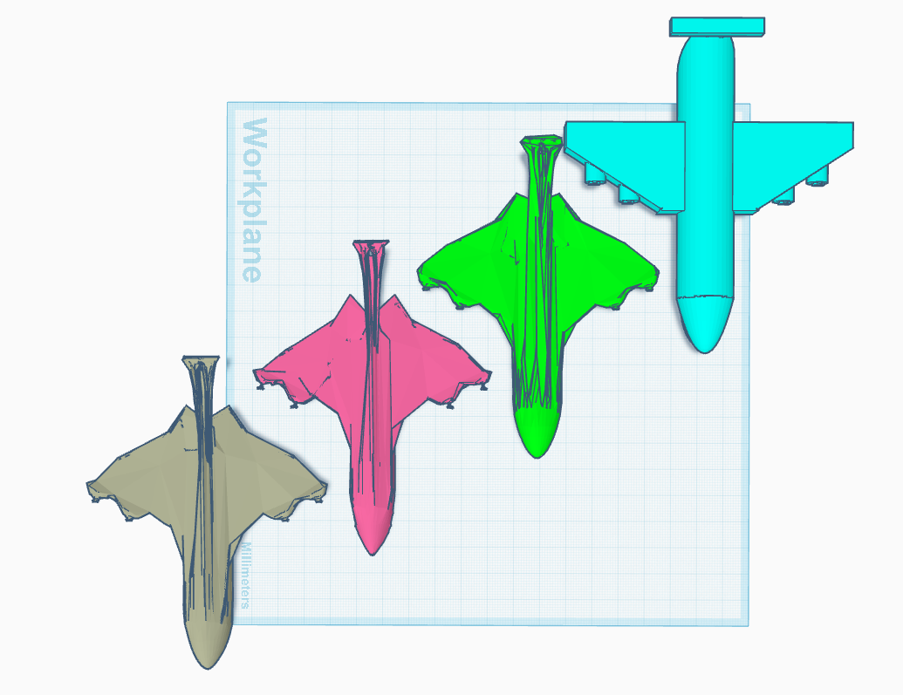
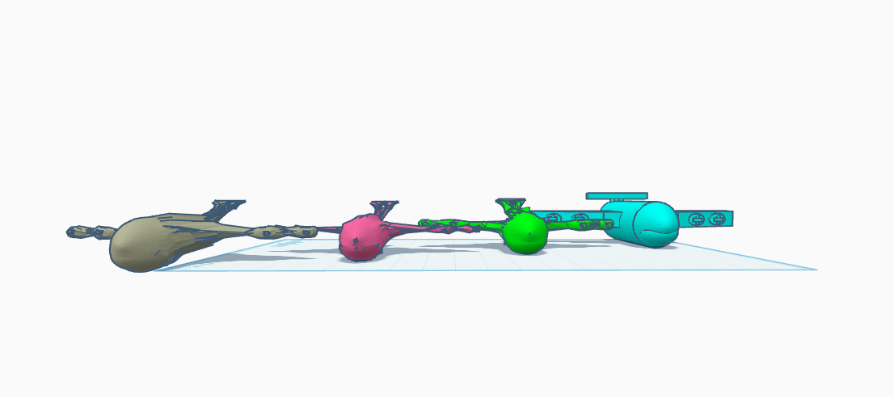
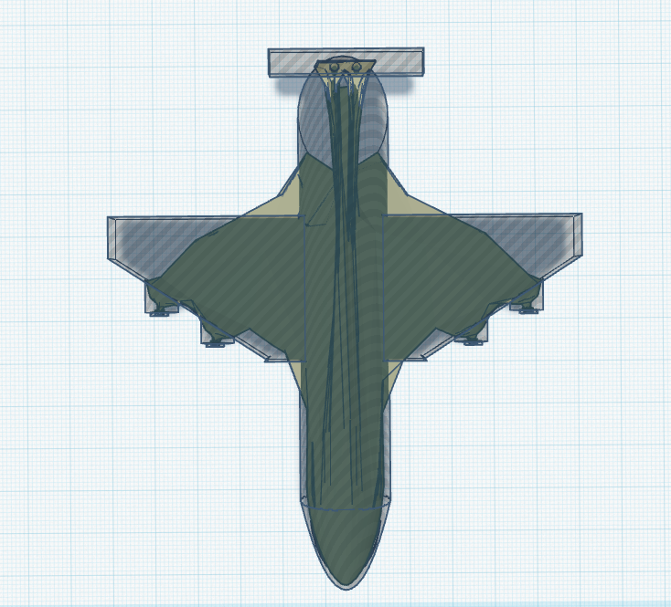
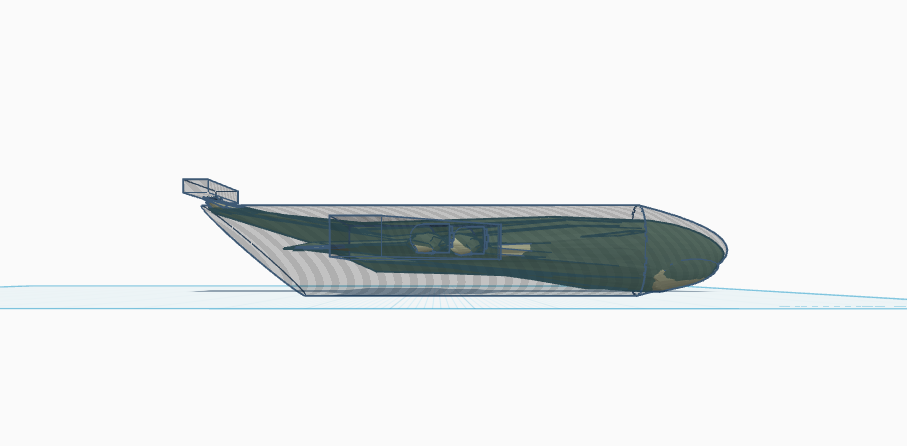

## README.md
# Aerodynamic Optimization

This is a Fortran & Python based Program that optimizes the shape of an object (either **minimize drag** or **maximize lift to drag ratio**) from an .obj file using various Physics and Mathematical tools (Aerodynamic Drag / lift calculation,Laplacian smooth, contangent geometry analysis, 3d vector models and more...)

Replace **input.obj**  with any model file and run **main.py**
**MAKE SURE THE MODEL IS FACING THE +x AXIS**

some example of a modeled airplane optimized :
# Example (Top)

# Example (Front)

Blue - Input file

Green - Medium mesh, Medium steps ,NO smooth

Pink - High mesh, Medium step, 10 step smooth

Grey - High mesh, High step, 50 step smooth

---
  
# Example (Difference)

Model works by dividing the object into mesh structures to process; higher the number of vertices, the more detailed the mesh and a longer run time.

